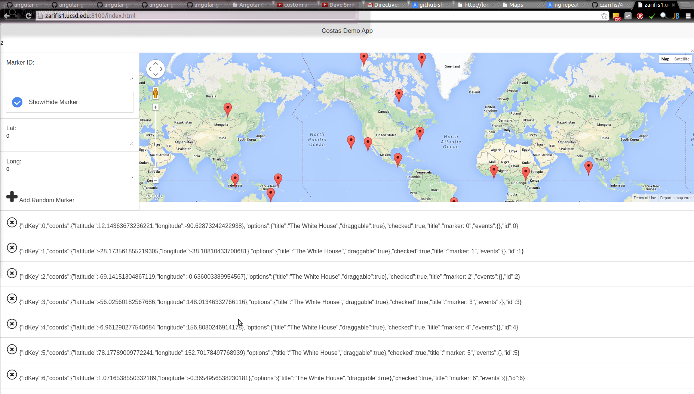

AngSample
=========

Little AngularJS Demo that uses the [Angular Google Maps](https://angular-ui.github.io/angular-google-maps/#!/) module.

How to run 
=========

In order to run this example you need ionic. Instructions on how to install ionic can be found [here](http://blog.zarifis.info/getting-started-with-ionic-angularjs-cordova/). After installing ionic just do:

	git clone https://github.com/czarifis/AngSample.git
    cd AngSample
    ionic serve
    
Sample Image of the UI
========

